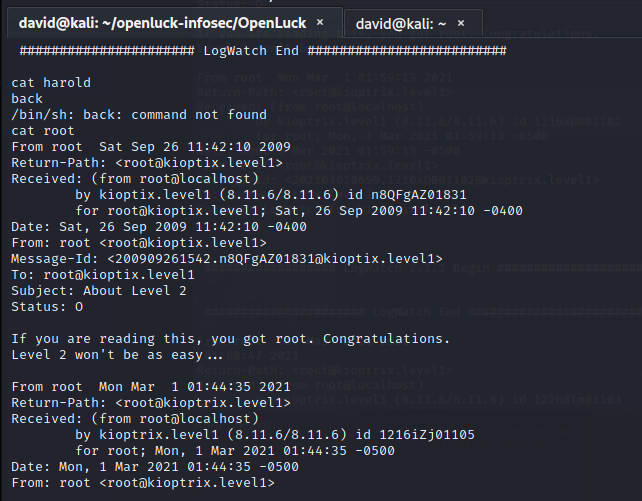

## Reporte de Vulnerabilidad

### Nombre de la vulnerabilidad
Ataque con OpenLuck 

### Descripción de la vulnerabilidad
SSL es el estandar en seguridad en línea. Se utiliza para cifrar los datos enviados a través de Internet entre un cliente (su equipo) y un servidor (máquina del sitio web). La eliminación de SSL degrada una conexión HTTPS (Protocolo Seguro de Transferencia de Hipertexto) a una que es HTTP (protocolo menos seguro y desactualizado). La falta de este certificado evita automáticamente muchos tipos de ataques. Por ejemplo: si un pirata informático intercepta datos cifrados, él no puede cifrarlos ni leerlos sin una clave de descrifrado privada. 

### Aplicativo de la vulnerabilidad
Máquina Virtual Kioptrix Nivel 1

### Payload 
Privilegios de super usuario en el sitio vulnerable.

### Pasos de reproducción.
1. Desde el navegador web ingresar a la IP del servidor vulnerable.
2. Con el directorio del aplicativo buscar un archivo que tenga error de conexión (estado 403) para corroborar versión del servidor Apache y puerto abierto disponible.
3. Realizar el ataque con estos datos obtenidos.
4. Comprometer datos íntegros del aplicativo.

### Impacto
El atacante puede percibir información vital del sitio web y en base a las vulnerabilidades del aplicativo y escalar privilegios para luego explotarlos a su conveniencia. Por ejemplo: los datos personales de los usuarios y registros de la base de datos. 

### Mitigación
1. Comprar Certificado SSL.
2. Una vez que un navegador recibe el HSTS de un sitio web, se incluirá en la lista de precarga. La inclusión en la lista evita que se realicen futuras conexiones HTTP inseguras. 
3. Configurar una red privada virtual (VPN).
4. Configurar un archivo .htaccess para evitar inyectar enrutamientos.

### Referencias
- https://hashtoolkit.com/generate-hash/?text=%241%24Xx6dZdOd%24IMOGACl3r757dv17LZ9010
- https://www.eurodns.com/blog/ssl-stripping-attack-prevention
- https://www.venafi.com/education-center/ssl/common-ssl-attacks
- https://md5.gromweb.com/?string=%241%24zL4.MR4t%2426N4YpTGceBO0gTX6TAky1
- https://vold3m0rt.medium.com/kioptrix-level-1-285e1ae90162
- https://www.reddit.com/r/HowToHack/comments/d1ji3o/kali_linux_missing_usrsharewordlists/
- https://github.com/rapid7/metasploit-framework/issues/6084
- https://github.com/rapid7/metasploit-framework/issues/12654
- https://github.com/heltonWernik/OpenLuck

### PoC
Capturas de pantalla de los datos que se lograron obtener con este ataque.

